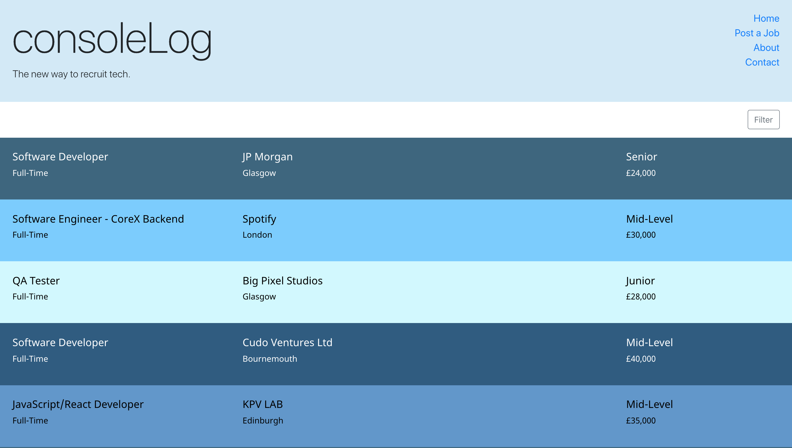
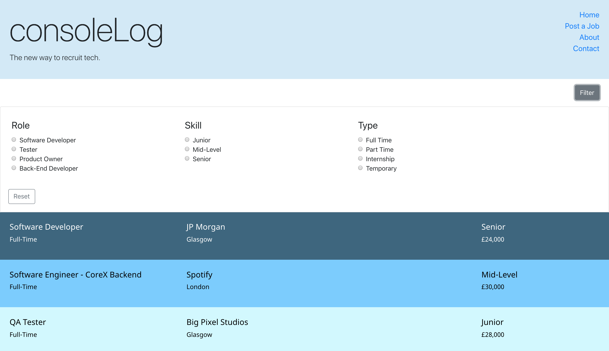
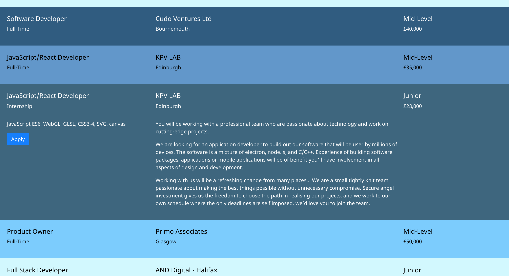
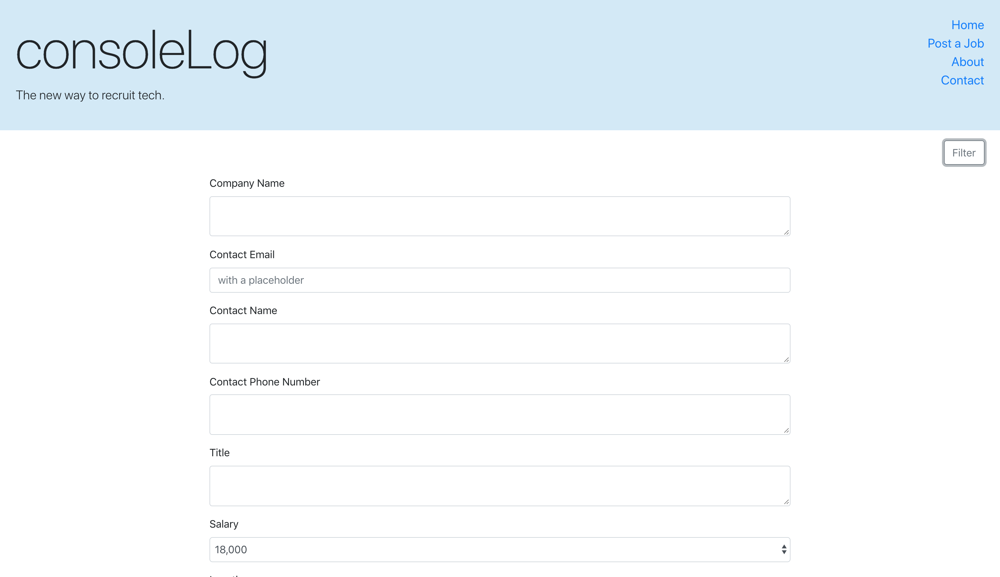

# Paired Project: Recruitment App

## Brief
Develop a full stack app to facilitate users to browse jobs and clients to add jobs.

**Why?**

As two (trainee) Software Engineers who are looking at the jobs market, we noticed the overcomplicated and oversaturated visual design of recruitment websites.
This made it difficult to navigate these websites, so we want to provide a solution to this problem.

## Time Restraint
6 days

## Table of contents
* [MVP](#mvp)
* [Extensions](#extensions)
* [Global Scope](#global-scope)
* [Status](#status)
* [Technologies](#technologies)
* [Screenshots](#screenshots)

## MVP
 * The app should display all jobs on the main page, without any other clutter (advertising, distracting links, etc.).
 * The app should allow the user to view jobs without having to give over any details/login information.
 * The app should allow the user to filter by role (software developer, tester, product owner, etc.).
 * The app should allow the user to filter by skill level (graduate, junior, mid-level, senior).
 * The app should allow the user to filter by type (part-time, full-time, contract, internship).
 * The app should allow the user to see all relevant job information.
 * The app should direct the user by link/button to the client’s website application.
 * The app should allow the client to add a job listing directly.

## Extensions
 * The app should allow the client to enter a job listing, which will then be moderated on the back-end of the site by our     Moderator Team to activate the listing on the main job listings. This will allow for more control over the job details and keep a nice consistency in the postings.
 * The app should allow for our Moderator Team to view pending jobs, and amend_delete_submit to the job listings.
 * The app should allow users to filter jobs by tech language (Ruby, Java, JavaScript, etc.).
 * The app should allow users to filter jobs by location.
 * The app should allow users to filter jobs by salary range.
 
 ## Global Scope
  * The app should allow users to browse on mobile.
 * The app should allow clients to add jobs on mobile.
 * The app should have a secure login for our Moderator Team.
 * The app should allow the client to have their own login details so they can manage their job listings.
 * The app should allow clients to pay for premium job listings which would give high priority and visibility on the main page.

## Status
Project is: _in progress_

## Technologies
* Language - Java, Javascript
* Styling - CSS, Reactstrap
* Database - PSQL
* Others - Spring, React, Hibernate

## Screenshots
### Front Page

### Filter Dropdown

### Job Description Dropdown

### Add Job to List

